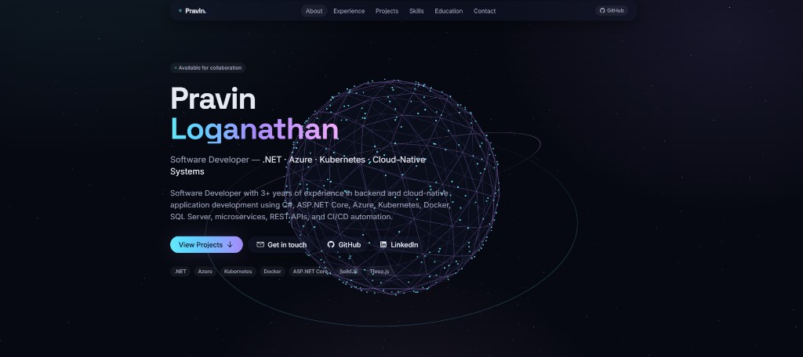

# Portfolio

A high-aesthetic developer portfolio built with **SolidJS + Vite + UnoCSS + Three.js**.
Live GitHub repo fetching, glassmorphism UI, animated wireframe-globe background, responsive on every device.



> All personal content lives in a single JSON file: [`portfolio.config.json`](./portfolio.config.json).
> Fork, edit that one file, push — your portfolio deploys.

---

## Quick start (fork)

1. **Fork** this repo on GitHub.
2. Clone your fork:
   ```bash
   git clone https://github.com/<your-user>/<your-fork>.git
   cd <your-fork>
   npm install
   ```
3. Open **`portfolio.config.json`** and replace every field with yours (see [Configuration](#configuration) below).
4. Run locally:
   ```bash
   npm run dev
   ```
   Open <http://localhost:5173>.
5. Push to your `main` branch. The GitHub Action auto-deploys to GitHub Pages.

That's it. No code touched.

---

## Configuration

Everything is in [`portfolio.config.json`](./portfolio.config.json). A JSON schema ([`portfolio.schema.json`](./portfolio.schema.json)) provides IDE autocomplete.

### Top-level shape

| Key              | Purpose                                                      |
| ---------------- | ------------------------------------------------------------ |
| `profile`        | Name, role, contacts, social links, resume URL, hero chips   |
| `stats`          | Key-value tiles shown in the About section                   |
| `experience`     | Job history with nested project cards or bullet highlights   |
| `education`      | Schools, degrees, periods                                    |
| `skills`         | Grouped tech stack (Languages, Backend, Cloud/DevOps, …)     |
| `certifications` | Cert entries with optional brand icon (`azure`, `aws`, `gcp`, or any [simple-icons](https://simpleicons.org/) slug) |

### `profile` fields

```jsonc
{
  "name": "Your Name",
  "role": "Software Developer",
  "tagline": "Short subtitle under your name",
  "location": "City, Country",
  "email": "you@example.com",
  "phone": "+00 0000000000",
  "github": "https://github.com/<user>",
  "githubUser": "<user>",            // used for live repo fetch
  "linkedin": "https://linkedin.com/in/<user>",
  "linkedinUser": "<user>",
  "resumeUrl": "https://docs.google.com/document/d/.../edit",
  "summary": "One-paragraph elevator pitch.",
  "availability": "Open to work",     // optional status chip
  "heroChips": [".NET", "Azure", "..."] // chips shown under hero buttons
}
```

### Projects section

Projects are **fetched live** from `https://api.github.com/users/{githubUser}/repos` on every page load. Repos are auto-sorted by stars + forks + recency, tech-stack tags are inferred from language, GitHub topics, and name/description patterns. No manual project list needed — just point `githubUser` at your account.

Filters: `owned` (default, hides forks), `all`, `starred`. Search box matches across name, description, language, topics.

---

## Scripts

```bash
npm run dev       # vite dev server (HMR)
npm run build     # production build → dist/
npm run preview   # preview the built dist/ locally
npm run deploy    # build + push dist/ to gh-pages branch (manual route)
```

---

## Deploy to GitHub Pages

### Option A — automatic (recommended)

The included workflow at [`.github/workflows/deploy.yml`](./.github/workflows/deploy.yml) deploys on every push to `main`.

One-time setup in your fork:

1. **Settings → Pages → Source: `GitHub Actions`**
2. Push any commit to `main`.
3. Watch the **Actions** tab — the deploy URL appears in the run summary.

Works for both:

- **User site** (`<user>.github.io`) — name the repo `<user>.github.io`
- **Project site** (`<user>.github.io/<repo>`) — any other repo name

`vite.config.ts` uses `base: "./"` so both work without changes.

### Option B — manual

```bash
npm run deploy
```

Pushes `dist/` to a `gh-pages` branch via the `gh-pages` package. Then set **Settings → Pages → Source: `gh-pages` branch**.

---

## Tech stack

| Layer       | Choice                                     |
| ----------- | ------------------------------------------ |
| Framework   | [SolidJS](https://www.solidjs.com/) 1.9    |
| Build       | [Vite](https://vitejs.dev/) 6              |
| Styling     | [UnoCSS](https://unocss.dev/) (atomic)     |
| Icons       | Carbon + Simple Icons (via UnoCSS presets) |
| 3D / BG     | [Three.js](https://threejs.org/)           |
| Fonts       | Inter, Space Grotesk, JetBrains Mono       |
| Deploy      | GitHub Pages via GitHub Actions            |

---

## Project structure

```
.
├── portfolio.config.json     ← edit this
├── portfolio.schema.json     ← JSON schema for IDE hints
├── .github/workflows/deploy.yml
├── src/
│   ├── App.tsx
│   ├── index.tsx
│   ├── styles.css
│   ├── components/
│   │   ├── Background.tsx    Three.js wireframe globe + starfield
│   │   ├── Nav.tsx           sticky nav + scroll progress
│   │   ├── Hero.tsx
│   │   ├── About.tsx
│   │   ├── Experience.tsx
│   │   ├── Projects.tsx      live GitHub fetch + filters + search
│   │   ├── Skills.tsx        per-category accent + brand icons
│   │   ├── Education.tsx
│   │   └── Contact.tsx
│   └── lib/
│       ├── data.ts           typed re-export of the JSON
│       └── github.ts         API fetch + rank + tech-stack inference
├── index.html
├── uno.config.ts
├── vite.config.ts
└── tsconfig.json
```

---

## Customization tips

- **Theme colors** — `uno.config.ts` → `theme.colors.accent.{cyan,violet,pink}`.
- **Background animation** — `src/components/Background.tsx`. Swap geometry, change colors, or replace with your own scene.
- **Add a skill icon** — Skills section auto-maps known names to brand icons in `src/components/Skills.tsx`. Add new mappings to the `ICON` record.
- **Disable a section** — remove the component import + render in `src/App.tsx`.

---

## License

MIT — fork freely.
